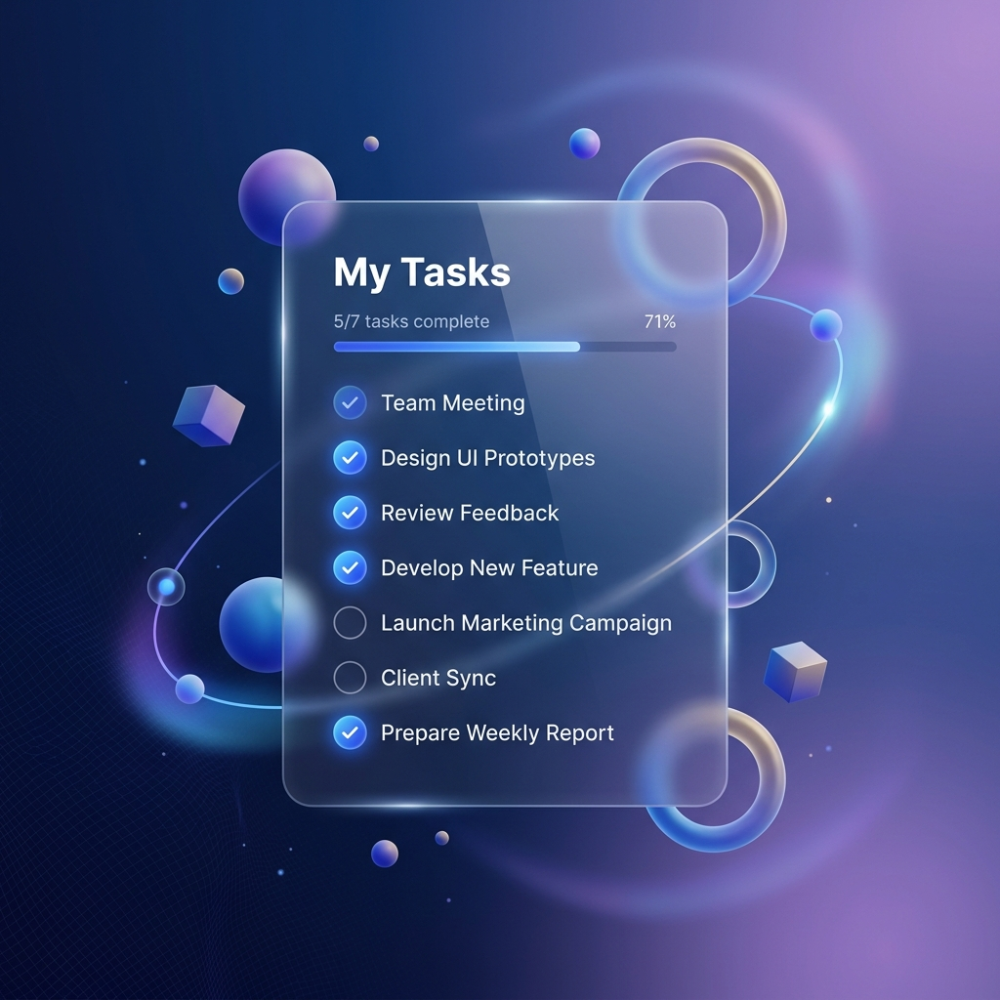

# TaskFlow — Manajemen Tugas yang Elegan

<div align="center">



**Satu tempat untuk semua tugasmu. Tetap terorganisir, tetap produktif.**

[](https://developer.mozilla.org/en-US/docs/Web/HTML)
[](https://developer.mozilla.org/en-US/docs/Web/CSS)
[](https://developer.mozilla.org/en-US/docs/Web/JavaScript)
[](https://developer.mozilla.org/en-US/docs/Web/API/Window/localStorage)

</div>

---

## 📋 Deskripsi

**TaskFlow** adalah aplikasi manajemen tugas (todo-list) berbasis web yang dibangun dengan teknologi web standar tanpa framework atau backend. Didesain dengan estetika modern untuk meningkatkan produktivitas developer dan pengguna sehari-hari.

Proyek ini merupakan tugas UTS praktikum **Pemrograman Berbasis Web (PBW)** yang menerapkan konsep:
- Manipulasi DOM dengan JavaScript murni
- Sistem autentikasi simulasi berbasis `localStorage`
- Arsitektur kode modular (multi-file JS)
- Desain UI/UX modern dengan Dark Glassmorphism theme

---

## ✨ Fitur Utama

| Fitur | Deskripsi |
|-------|-----------|
| 🔐 **Autentikasi Pengguna** | Registrasi & login dengan validasi ketat (username, password strength, konfirmasi) |
| 📝 **CRUD Task** | Buat, baca, perbarui, dan hapus task secara penuh |
| 💾 **Persistensi Data** | Semua data tersimpan di `localStorage` — tidak hilang meski browser ditutup |
| 🏷️ **Label & Prioritas** | Tandai task berdasarkan tingkat urgensi |
| 📤 **Export Wallpaper** | Ekspor daftar task sebagai gambar wallpaper via Canvas API |
| 🌓 **Greeting Dinamis** | Sapaan berubah otomatis berdasarkan waktu (Pagi/Siang/Sore/Malam) |
| 🔒 **Session Management** | Sesi login persisten; logout otomatis menghapus sesi aktif |
| 📊 **Password Strength Meter** | Indikator real-time kekuatan password saat registrasi |

---

## 🗂️ Struktur Proyek

```
UTS/
├── index.html          ← Halaman Landing Page (publik)
├── app.html            ← Halaman Utama Aplikasi (setelah login)
├── assets/
│   └── hero_illustration.png
├── css/
│   ├── landing.css     ← Style khusus halaman landing
│   └── style.css       ← Style utama halaman aplikasi
└── js/
    ├── main.js         ← Entry point — inisialisasi aplikasi
    ├── auth.js         ← Registrasi, login, logout, validasi password
    ├── storage.js      ← Abstraksi baca/tulis localStorage
    ├── task.js         ← Operasi CRUD task (tambah, edit, hapus)
    ├── ui.js           ← Render UI, DOM manipulation, greeting
    ├── utils.js        ← Fungsi utilitas (format tanggal, dll)
    └── export.js       ← Ekspor task ke gambar wallpaper (Canvas API)
```

---

## 🚀 Cara Menjalankan

Karena ini adalah aplikasi **pure HTML/CSS/JS** tanpa build tools, cara menjalankannya sangat mudah:

### Cara 1 — Buka Langsung di Browser
```
Klik dua kali pada file: index.html
```

### Cara 2 — Via Live Server (VS Code)
1. Install ekstensi **Live Server** di VS Code
2. Klik kanan pada `index.html`
3. Pilih **"Open with Live Server"**
4. Browser akan terbuka otomatis di `http://127.0.0.1:5500`

### Cara 3 — Via Python HTTP Server
```bash
# Di dalam folder UTS/
python -m http.server 8080

# Lalu buka: http://localhost:8080
```

> ⚠️ **Catatan:** Tidak memerlukan instalasi `npm`, backend, atau database apapun.

---

## 🏗️ Arsitektur & Teknik

### Alur Autentikasi

```
index.html (Landing)
    │
    └─► app.html (Auth Gate)
             │
       [Cek localStorage]
             │
      ┌──────┴──────┐
      │             │
  [Belum Login]  [Sudah Login]
      │             │
  Form Auth      UI Aplikasi
  Register/Login  (showApp)
```

### Sistem Penyimpanan Data

```javascript
// Key yang digunakan di localStorage:
"todo_users"    → Array semua user yang terdaftar
"todo_current"  → Username user yang sedang aktif (sesi)
"todo_tasks_{username}" → Array task milik user tersebut
```

### Modul JavaScript

| File | Tanggung Jawab |
|------|----------------|
| `main.js` | Inisialisasi — mengecek sesi dan memanggil `showApp()` atau form auth |
| `auth.js` | `doRegister()`, `doLogin()`, `doLogout()`, `checkStrength()`, `checkMatch()` |
| `storage.js` | `getUsers()`, `saveUsers()`, `getTasks()`, `saveTasks()` |
| `task.js` | `addTask()`, `editTask()`, `deleteTask()`, `toggleComplete()` |
| `ui.js` | `renderTasks()`, `showApp()`, `showGreeting()`, filter & sort UI |
| `utils.js` | `formatDate()`, `generateId()`, helper functions |
| `export.js` | `exportAsWallpaper()` menggunakan Canvas API |

---

## 🔐 Validasi Password

Saat registrasi, sistem memvalidasi password secara real-time dengan aturan:

- ✅ Minimal **8 karakter**
- ✅ Mengandung **huruf kapital** (A-Z)
- ✅ Mengandung **huruf kecil** (a-z)
- ✅ Mengandung **angka** (0-9)
- ✅ Mengandung **karakter spesial** (!@#$%...)

Password disimpan menggunakan `btoa()` (Base64 encoding) sebagai simulasi masking — **hanya untuk tujuan pembelajaran**.

---

## 🎨 Design System

| Elemen | Detail |
|--------|--------|
| **Tema** | Dark Glassmorphism |
| **Font** | Plus Jakarta Sans (Google Fonts) |
| **Icons** | Bootstrap Icons v1.10 |
| **Warna Utama** | `#60a5fa` (Blue), `#1e293b` (Dark), `#f8fafc` (Light) |
| **Effect** | `backdrop-filter: blur()`, gradient overlay, box-shadow |

---

## 📸 Tangkapan Layar

### Halaman Landing
> Landing page dengan hero section dan daftar fitur

### Halaman Autentikasi
> Form login & register dengan animasi slide dan password strength meter

### Dashboard Aplikasi
> Tampilan utama dengan greeting dinamis, form tambah task, dan daftar task

---

## 🛠️ Teknologi yang Digunakan

- **HTML5** — Struktur semantik
- **CSS3** — Custom styling (Glassmorphism, Flexbox, Grid, Animasi)
- **JavaScript (ES6+)** — Logika aplikasi, DOM manipulation
- **localStorage API** — Penyimpanan data persisten di browser
- **Canvas API** — Ekspor task ke gambar
- **Google Fonts** — Tipografi modern
- **Bootstrap Icons** — Ikon

---

## 👨‍💻 Informasi Pengembang

> Proyek ini dikembangkan sebagai bagian dari tugas UTS  
> Mata Kuliah: **Pemrograman Berbasis Web (PBW)**

---

## 📄 Lisensi

Proyek ini dibuat untuk keperluan akademis. Bebas digunakan sebagai referensi pembelajaran.
